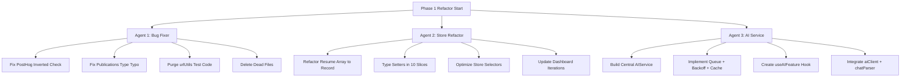

# HustryCV — Architecture Review & Refactor Summary

This document summarizes the comprehensive codebase review, strategic analysis, and Phase 1 implementation planning completed during this chat session for **HustryCV** (the AI-powered React Native resume builder app).

## Session Overview
Acting as a technical cofounder, React Native architect, and AI product engineer, we conducted a rigorous architectural review of the production codebase. The goal was to identify scalability bottlenecks, AI/UX improvements, structural vulnerabilities, and code quality issues, and to formulate an action plan before scaling the product.

All review deliverables, implementation blueprints, and context files have been copied to the repository under the directory:
📂 `docs/architecture-review/`

---

## 📂 Copied Artifacts

Inside the `docs/architecture-review/` directory, you will find:

1. **[hustrycv_deep_review.md](file:///Users/kishantalekar/Desktop/CODE_PG/WEB/hustrycv/docs/architecture-review/hustrycv_deep_review.md)**
   * **Scope**: Comprehensive architectural critique, UX evaluation, AI service strategy, scalability concerns, security reviews, and monetization blueprints.
   * **Key Highlights**: Detailed analysis of Zustand store performance issues, scattered AI clients, incorrect analytics settings, duplicate types, and dead/test code left in production files.

2. **[implementation_plan.md](file:///Users/kishantalekar/Desktop/CODE_PG/WEB/hustrycv/docs/architecture-review/implementation_plan.md)**
   * **Scope**: Phase 1 execution plan addressing foundational bugs, Zustand store modernization, and a centralized AI service layer.
   * **Key Highlights**: Broken down into 4 decoupled workstreams mapped to 3 parallel agent roles to enable safe, conflict-free development.

---

## 🔑 Key Architectural Insights & Findings

### 1. Zustand Store Performance & Type Safety
* **Issue**: The current state stores resumes as a `Resume[]` array. This results in $O(N)$ operations on every selector call (`resumes.find(r => r.id === activeId)`), triggering redundant calculations and component re-renders. 
* **Type Safety**: Pervasive use of `set: any`, `as any` casts, and `@ts-ignore` bypasses across store slices weakens compile-time stability.
* **Resolution**: Refactor `resumes` from `Resume[]` into a lookup-optimized `Record<string, Resume>`. Type all setters correctly and clean up TypeScript overrides.

### 2. Centralized AI Service Layer
* **Issue**: AI calls (Gemini API) are scattered across multiple individual files (`bulletPointAI.ts`, `summaryAI.ts`, etc.) and instantiate separate instances of `GoogleGenAI`. There is no retry mechanism, queue, cache, token/cost tracking, or request cancellation support.
* **Resolution**: Build a central `AIService` class wrapping a single instance of `GoogleGenAI`. Equip it with priority queues, retries with exponential backoff, request timeouts, caching, and a reusable `useAIFeature` React Hook.

### 3. Critical Production Bugs Identified
* **PostHog Analytics**: The analytics initialization logic had an inverted check: `disabled: !__DEV__`. This meant analytics were disabled in production and enabled in development.
* **Typo Mismatch**: In `resume.types.ts`, `publications.type` was hardcoded to return `'awards'` instead of `'publications'`, introducing subtle data model inconsistencies.
* **Module-level Test Code**: `urlUtils.ts` contained active test assertions running directly at the module level on every single application startup.
* **Dead Code**: comment-only or duplicate files like `resumeChatManager.ts`, duplicate `prompts.ts`, and dead `social.types.ts` were cluttering the repo.

---

## 🚀 Phase 1 Implementation Plan

We designed **4 distinct workstreams** mapped to **3 parallel developer agents**:

### Decoupled Execution Strategy
* **Agent 1 (Bug Fixer)**: Handles low-risk critical bugs and dead weight removal.
* **Agent 2 (Store Refactor)**: Reconstructs Zustand store slices and selectors.
* **Agent 3 (AI Service)**: Installs the new `services/ai/` directory and hook layer.
* **Zero Conflicts**: The files modified by each agent do not overlap, enabling high-velocity, concurrent execution.

---

## 📝 Next Steps for Execution
1. **Initialize Subagents**: When execution starts, launch the 3 subagents concurrently matching their specified roles.
2. **Execute Workstreams**: Run code changes, ensuring that type checking (`yarn ts`) and linting pass at each milestone.
3. **Verify App**: Run the verification checklist (automated builds + manual testing of resume creation, template switching, and AI features).
